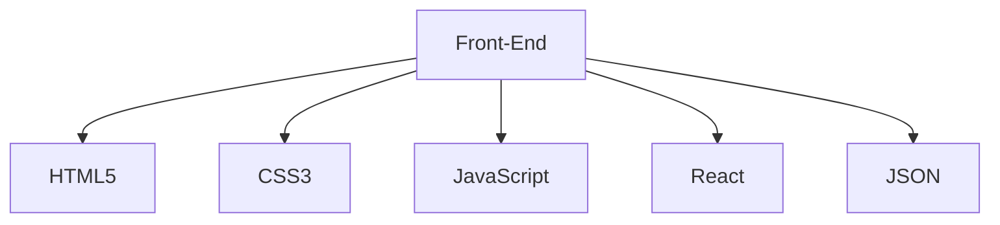
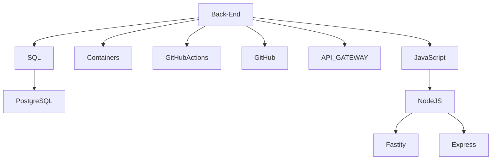

 
 <h1 align="center">Github Metrics </h1>

  
   
  
  

 

 

 
 

```mermaid
graph TD;
    Front-End-->HTML5;
    Front-End-->CSS3;
    Front-End-->JavaScript;
    Front-End-->React;
    Front-End-->JSON;
    
```

```mermaid
graph TD;
    Back-End-->SQL;
    Back-End-->Containers;
    SQL-->PostgreSQL;
    Back-End-->GitHubActions;
    Back-End-->GitHub;
    Back-End-->API_GATEWAY;
    Back-End-->JavaScript
    JavaScript-->NodeJS
    NodeJS-->Fastity;
    NodeJS-->Express;
    
    
```

 
 
   
   
  
       
  
  
   
   
   

       
 

 
<b>Visitors Count 👽 </b>
  

 
 

